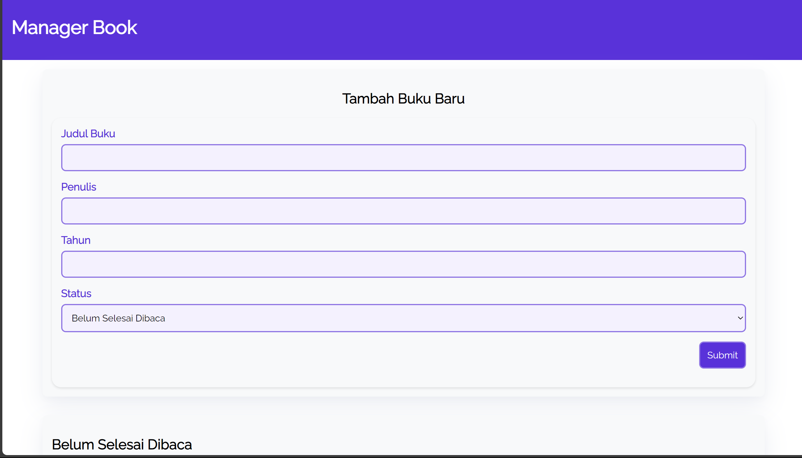

# Book Manager

Book Manager adalah aplikasi sederhana yang memungkinkan pengguna untuk mengelola daftar buku yang ingin dibaca dan buku yang sudah selesai dibaca. Aplikasi ini dibangun menggunakan HTML, CSS, dan JavaScript.

## Fitur

- **Tambahkan Buku**: Pengguna dapat menambahkan judul buku baru ke dalam daftar buku yang ingin dibaca.
  
- **Pindahkan ke Rak Selesai**: Pengguna dapat memindahkan buku dari daftar "Akan Dibaca" ke daftar "Sudah Dibaca" setelah selesai membacanya.
  
- **Hapus Buku**: Pengguna dapat menghapus buku dari daftar buku yang ingin dibaca atau dari daftar buku yang sudah selesai dibaca.

## Cara Menggunakan

1. **Tambahkan Buku**: Masukkan judul buku yang ingin Anda tambahkan ke dalam kotak input dan tekan tombol "Tambah".
   
2. **Pindahkan ke Rak Selesai**: Setelah selesai membaca buku, klik tombol "Selesai" di samping buku untuk memindahkannya ke rak "Sudah Dibaca".
   
3. **Hapus Buku**: Untuk menghapus buku dari daftar, klik tombol "Hapus" di samping buku yang ingin Anda hapus.

## Preview

## Teknologi yang Digunakan

- HTML
- CSS
- JavaScript

